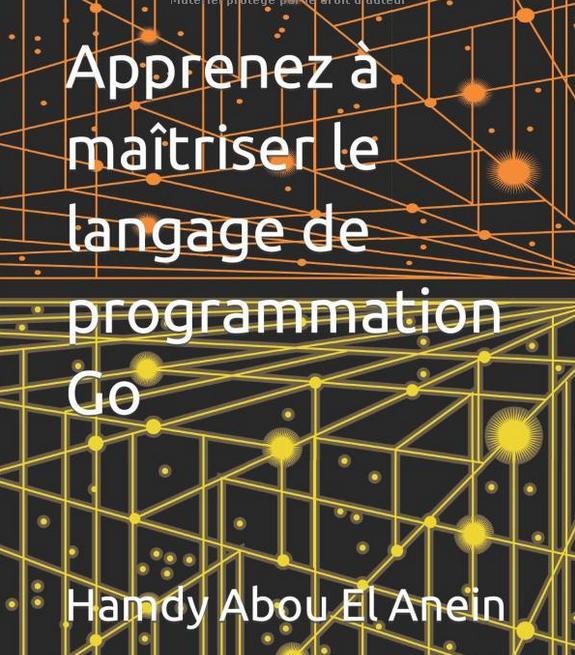

# Programmes du livre : [Apprenez à maîtriser le langage de programmation Go](https://www.amazon.fr/Apprenez-ma%C3%AEtriser-langage-programmation-Go/dp/B0BW345PWR/ref=sr_1_7?__mk_fr_FR=%C3%85M%C3%85%C5%BD%C3%95%C3%91&crid=2QJL21OFZPZOB&keywords=programmation+go&qid=1676891590&sprefix=programmation+go%2Caps%2C115&sr=8-7)      
       

Auteur : [Hamdy Abou El Anein](https://www.amazon.fr/Hamdy-Abou-El-Anein/e/B0BM89T88X/ref=aufs_dp_fta_dsk)    
